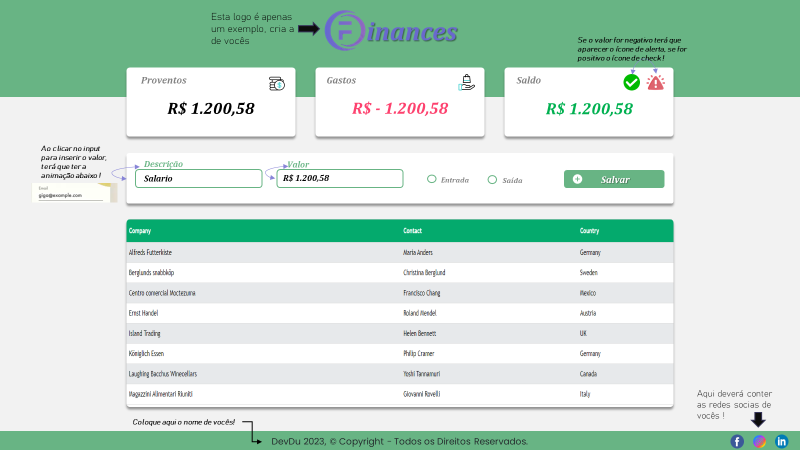

# Olá Mundo #

Primeiro projeto web proposto pelo analista de dados da Farmes, <strong>YAGO ITALO</strong>. Onde foi dado o desafio de desenvolver uma página web para uma organização financeira do usuário, o desafio foi: 

### PRIMEIRA ETAPA ###
* Utilizar HTML e CSS puro ;
* Usar o template criado pelo Yago como base no desenvolvimento ;

 <strong>Autoria: Italo, Yago</strong>

* Estilização totalmente da página;
* Ter o conhecimento no que foi feito tanto no HTML, quanto no CSS ;
* Apresentar na sexta-feira(25/08) o layout ; 

### SEGUNDO PASSO ###
 
 * EM BREVE...